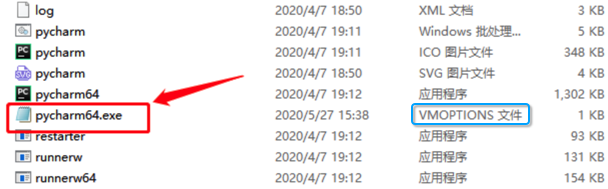

# 文件后缀名

## 举例：缺少文件pycharm64.exe.vmoptions

### 问题

[安装Pycpycharm到破解时bin文件夹只有一个pycharm64.exe.vmoptions怎么办 -CSDN论坛](https://bbs.csdn.net/topics/396681221)

为何少了pycharm64.exe.vmoptions文件？

### 解答

如箭头所示的红色框内文件

* 新手以为：
  * 只看到文件（文本文件的图标的）： `pycharm64.exe`
    * 缺少了（想要的）文件：`pycharm64.exe.vmoptions`
* 实际上是：
    * 其红色框标注的文件本身就是：`pycharm64.exe.vmoptions`
      * 而**不是**`pycharm64.exe`
    * 因为其后面的**类型**写的清清楚楚是：`VMOPTIONS文件`
      * 
        * 表示文件后缀名是：`.vmoptions`
          * 所以**完整的文件名**是：`pycharm64.exe.vmoptions`

### 引申

所以如果去Windows中设置`显示文件名后缀`后，就可以看到完整的文件名`pycharm64.exe.vmoptions`了

且其他的文件，也都可以看到完整的文件名了，比如：

* 类型是`应用程序`的`pycharm64`
    * -> `pycharm64.exe`
* 类型是`Windows批处理`的`pycharm `
    * -> `pycharm.bat`
      * 或 `pycharm.cmd`？
* 类型是`ICO图片文件`的`pycharm `
    * -> `pycharm.ico`
      * 是图标类型文件
* 类型是`应用程序`的`restarter`
    * -> `restarter.exe`

关于如何显示文件的后缀名，详见后续整理。

