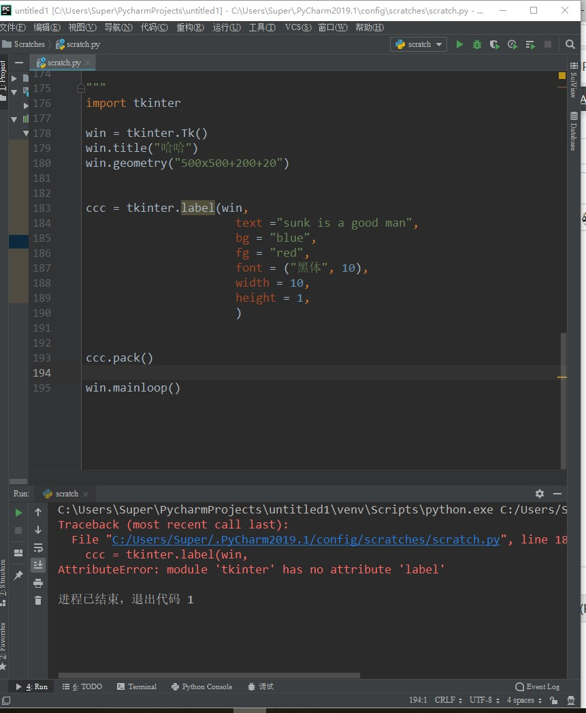
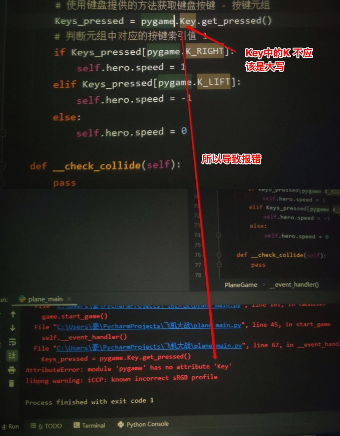

# 大小写有误导致属性报错

## 举例：tkinter的label中l应该大写

### 问题

[小白遇到一个关于Pycharm中 Tkinter问题-CSDN论坛](https://bbs.csdn.net/topics/392593162)



### 解答

先从问题入手，看到你的错误提示是：

`AttributeError: module ’tkinter’ hs no attribute ‘label'`

-》字面意思是：`tikinter`这个（变量?库？）没有`label`这个属性

-》为何没有？虽然我也不熟悉此问题具体的细节，但是我有学习能力和解决问题能力

下面记录解决问题的过程：

首先已知python（好像是）有个（内置的）库叫：`tkinter`

所以去google搜：

`python tkinter`

`python tkinter label`

找到一些资料：

* [Tk图形用户界面(GUI) — Python 3.8.2 文档](https://docs.python.org/zh-cn/3/library/tk.html)
* [tkinter --- Tcl/Tk的Python接口 — Python 3.8.2 文档](https://docs.python.org/zh-cn/3/library/tkinter.html#tkinter-modules)
* [tkinter — Python interface to Tcl/Tk — Python 3.8.2 documentation](https://docs.python.org/3/library/tkinter.html)
* [Python GUI 编程(Tkinter) | 菜鸟教程](https://www.runoob.com/python/python-gui-tkinter.html)

看到一些资料：

> Python3.x 版本使用的库名为 tkinter,即首写字母 T 为小写。
> 
> `import tkinter`
> 
> 要使用 Tkinter 通常你只需要一条简单的 import 语句:
> `import tkinter`
>
> 或者更常用的:
> 
> `from tkinter import *`

* [Python - Tkinter Label - Tutorialspoint](https://www.tutorialspoint.com/python/tk_label.htm)
* [Tkinter教程之Label篇_Python_灵蛇舞动-CSDN博客](https://blog.csdn.net/jcodeer/article/details/1811293)

```python
from Tkinter import *
#初始化Tk
root = Tk()
#创建一个label，使用编码，到现在为止还没有使用过直接通过“drag-and-drop”就可以完成的IDE。
label = Label(root,text = 'Hello Tkinter')
```

[Label & Button 标签和按钮 - 窗口 Tkinter | 莫烦Python](https://morvanzhou.github.io/tutorials/python-basic/tkinter/2-01-label-button/)

```python
l = tk.Label(window, 
    text='OMG! this is TK!',    # 标签的文字
    bg='green',     # 背景颜色
    font=('Arial', 12),     # 字体和字体大小
    width=15, height=2  # 标签长宽
    )
l.pack()    # 固定窗口位置”
```

[tkinter.ttk --- Tk主题小部件 — Python 3.8.2 文档](https://docs.python.org/zh-cn/3/library/tkinter.ttk.html#label-options)

```python
l1 = tkinter.Label(text="Test", fg="black", bg="white")
l2 = tkinter.Label(text="Test", fg="black", bg="white")
```
### 结论

* Python中的tkinter是自带的
    * 表示不用额外安装
* tkinter库的名称
    * Python 2中是大写的T：`Tkinter`
    * Python 3中是小写的T：`tkinter`
* Python 3中导入tkinter的常见写法
    * 有2种：
        * 普通的：`import tkinter`
        * 更常用的：`from tkinter import *`
* tkinter中的Label的L是大写的
    * 是从官网可以查看到的
        * [tkinter.ttk --- Tk主题小部件 — Python 3.8.2 文档](https://docs.python.org/zh-cn/3/library/tkinter.ttk.html#label-options)
* tkinter中使用Label的写法
    * 
    ```python
    import tkinter
    l1 = tkinter.Label(text="Test", fg="black", bg="white")
    ```
    * 或：
    ```python
    from tkinter import *
    l1 = Label(text="Test", fg="black", bg="white")
    ```

-> 你此处，把：

```python
ccc = tkinter.label(win
```

改为：

```python
ccc = tkinter.Label(win
```

即可。

## 引申=举一反三

* 为何你会把大写的Label 写成小写的label？
    * 因为：你没有去参考官网文档
* 为何你找不到官网文档？或者 不知道有官网文档？
    * 因为其实不熟悉正确的：学习思路
        * 好的学习思路是：有问题，尽量找官网技术文档
            * 因为官网技术文档，往往解释问题
                * 最清楚和明白：很多技术，官网资料写的往往都很通俗易懂
                * 最准确：不像别的资料可能会滞后或过期
* 如何学习好的学习思路和方法？
    * 参考我的教程
        * [学习方法思路及技术心得总结](https://book.crifan.com/books/learn_tech_method_experience/website/)
* Python小白如何避免常见的坑？
    * 参考当前教程 [Python新手小白常见错误和问题](https://book.crifan.com/books/python_newbie_mistakes_questions/website/) 的其他相关内容

## 举例：Pygame的Key的K大写是错误的

### 问题

[Pygame has no attribute key-CSDN论坛](https://bbs.csdn.net/topics/395849077)

### 解答

下图标识出错误位置：



```python
pygame.Key.get_pressed()
```

中的`Key`中的`K`，是**大写**，导致报错：

```bash
AttributeError: module 'pygame' has no attribute 'Key'
```

即：pygame没有Key这个属性

所以报错

-》就像原贴作者说的“按照视频的代码一模一样敲的，却运行出这个错误，看了下别人的，都没出现这个错误”

-》其实问题的原因，人家报错已经告诉你了：pygame没有Ke这个属性

-》那pygame为何没有Key这个属性呢？

-》因为根据官网访问解释：

[pygame.key — pygame v2.0.0.dev5 documentation](https://www.pygame.org/docs/ref/key.html#pygame.key.get_pressed)

> `pygame.key.get_pressed()`
> 
>   get the state of all keyboard buttons
> 
> get_pressed() -> bools

可以看出，`pygame.key`中的`key`中的`k`是**小写**

-》而你这里大写，不是人家这个pygame的库所支持的属性，所以报错

-》那为何会出现这个错误呢？

-》这就属于典型的情况了：新手在（参考别人代码）敲代码期间，不小心的发生了笔误，把小写的k，写成大写的K了

-》为何其他人，或者说有经验的人，不会出现这个问题呢？

-》那是因为：新手，小白，往往缺乏一些计算机编程语言的基础知识

-》放在此处就是：计算机编程语言（比如Python）中的基本知识是：变量是分大小写的

如果小白新手不注意，就会不小心出现笔误，导致变量属性找不到的问题

-》此处如何解决问题：

根据pygame的官网的要求，把Key改为key：

```python
pygame.key.get_pressed()
```

就可以解决问题了。
