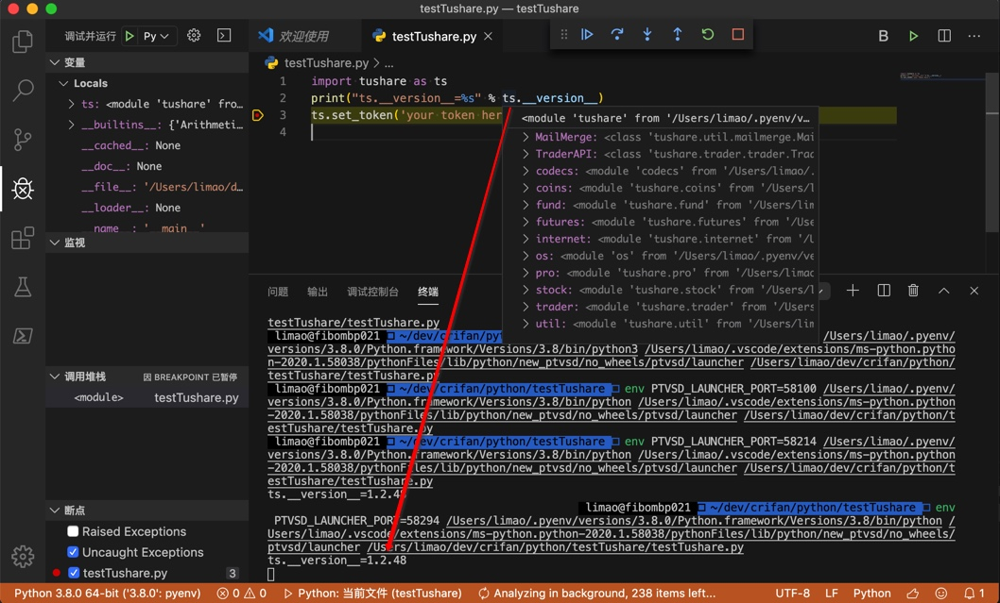
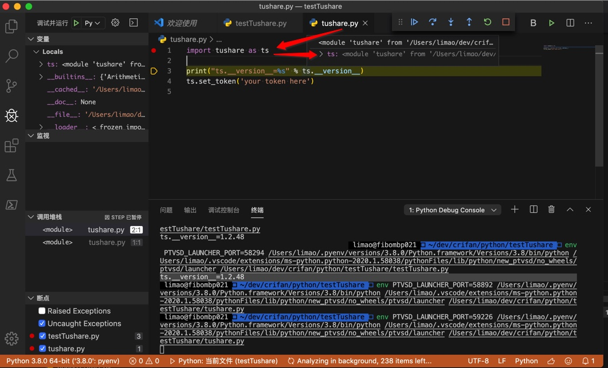
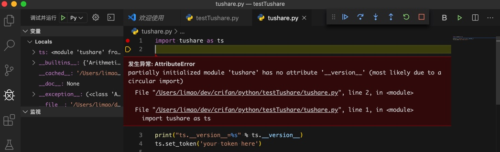
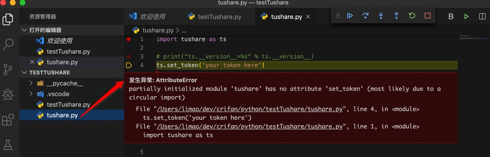
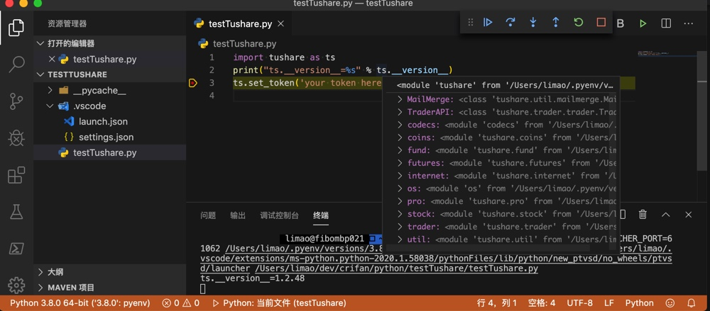

# 测试文件名和库同名

还有一种新手常见的问题是：把测试文件或变量的名字，和要调用的库名字一样，从而导致各种难以察觉的问题。

下面举例解释：

## 导入tushare出错

### 问题

[菜鸟求教tushare pro，看不懂的问题-CSDN论坛](https://bbs.csdn.net/topics/392515435)

### 解答

刚开始看，以为是其他什么问题呢。

帮其搜索：

tushare

找到：

[Tushare -财经数据接口包](http://tushare.org/)

> module tushare has no attribute set_token

[新人发帖求助！python使用tushare股票分析包方法报错-CSDN论坛](https://bbs.csdn.net/topics/391909458)

> 估计你的文件名叫tushare.py, 改个名就好了.

-> 那估计是这个问题了：小白测试python时，把测试文件，写成了：`tushare.py`

和要测试的库`tushare`重名了。

导致Python解析器去解析代码

```python
import tushare as ts
```

变成自己的测试文件`tushare.py`，而不是要测试的库`tushare`了。

也看到了别的类似的例子

[pycharm 导入tushare错误，请帮帮忙，百度半天也没搞定-CSDN论坛](https://bbs.csdn.net/topics/392233758)

```python
import tushare as ts
print(ts.__version__)
提示错误##########
D:\Programs\Anaconda3\python.exe D:/PythonWorks/PycharmProjects/Stocks/tushare.py
Traceback (most recent call last):
 File "D:/PythonWorks/PycharmProjects/Stocks/tushare.py", line 1, in <module>
import tushare as ts 
File "D:\PythonWorks\PycharmProjects\Stocks\tushare.py", line 2, in <module>
 print(ts.__version__)
AttributeError: module 'tushare' has no attribute '__version__'
Process finished with exit code 1
```

很明显就是同样的问题。

[关于tushare python的问题。-CSDN论坛](https://bbs.csdn.net/topics/392046043)

> 我下好了tushare 导入正确，但是在调用函数的时候，为什么总是报没有这个函数呢，

> `print(help(ts.get_k_data()))`

> AttributeError: module ‘tushare’ has no attribute ‘get_k_data’

> 或许你将tushare进行了改变，赋值替换了它或自己新建了一个叫tushare的文件

[AttributeError: module ‘tushare’ has no attribute ‘__version__’ · Issue #241 · waditu/tushare · GitHub](https://github.com/waditu/tushare/issues/241)

> 不要以tushare作为文件名

[在策略模块定义函数引用tushare pro – VincentZHOU – JoinQuant](https://www.joinquant.com/view/community/detail/f2a4717c09630f6adcbae3090ad412e4?type=2)

> 也有可能你的研究中有一个叫 tushare.py 的文件，导致没有调到真正的 tushare 包，如果有的话可以试着改个名字

此处Mac中去写代码测试效果：

先用pip安装库

【已解决】mac中pip安装Python库tushare

然后去VSCode中写代码测试：

起个正常的，典型的，用于测试的文件名：

比如：

`testTushare.py`

```python
import tushare as ts
print("ts.__version__=%s" % ts.__version__)
ts.set_token('your token here')
```

可以正常输出：

```bash
ts.__version__=1.2.48
```



而如果改为：

用于测试的文件名，和要测试的库`tushrare`同名，变成：`tushare.py`

```python
import tushare as ts
print("ts.__version__=%s" % ts.__version__)
ts.set_token('your token here')
```

加断点调试时就会发现，导入的`ts`，其实是空的，啥函数和属性都没有：



由此后面的代码：

```python
print("ts.__version__=%s" % ts.__version__)
```

就会报错了：

```bash
发生异常: AttributeError
partially initialized module ‘tushare’ has no attribute ‘__version__’ (most likely due to a circular import)
File “/Users/limao/dev/crifan/python/testTushare/tushare.py", line 2, in <module> File “/Users/limao/dev/crifan/python/testTushare/tushare.py", line 1, in <module> import tushare as ts
```



如果注释掉上面一行，用下面的

```python
ts.set_token('your token here')
```

去测试，也是同样问题：



与之对比：

名字不要是库名，即可正常导入和调试：



#### 结论

写(python)代码用于测试时，创建测试用的(python)文件

* **应该**：起个，见名知意的，更加易懂的，不容易混淆的文件名
    * 常见思路和做法：测试用的，演示用的文件名中 ，往往包含`test`，`demo`，`example`等字眼
    * 此处：
        * 举例：比较合适的写法
            * `testTushare.py`
            * `demoTushare.py`
            * `tushareDemo.py`
            * `tushareTest.py`
            * `tushareExample.py`
* **不应该**：和测试的库同名
    * 此处：
        * 用于写测试tushare的Python库的测试文件，不要写成：`tushare.py`
    * 坏处：会和原有的库冲突
        * 导致：import导入时，错误导入了自己的测试文件，而不是原有的库
* -》引申 + 举一反三 + 相关：
    * 也不应该：起个其他简单的，偷懒的名字
        * 典型的有：
            * `1.py`
            * `123.py`
            * `test.py`
            * `demo.py`
            * `a.py`
            * `abc.py`
            * 等等
        * 都是属于：
            * 坏习惯
            * 偷懒的写法
            * 容易和其他文件冲突的写法
            * 也不容易看懂=没法从你文件名看出你要做什么