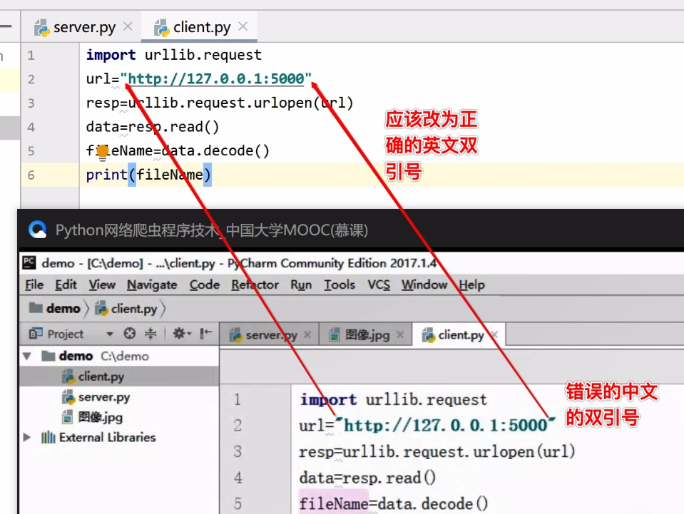
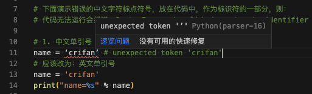
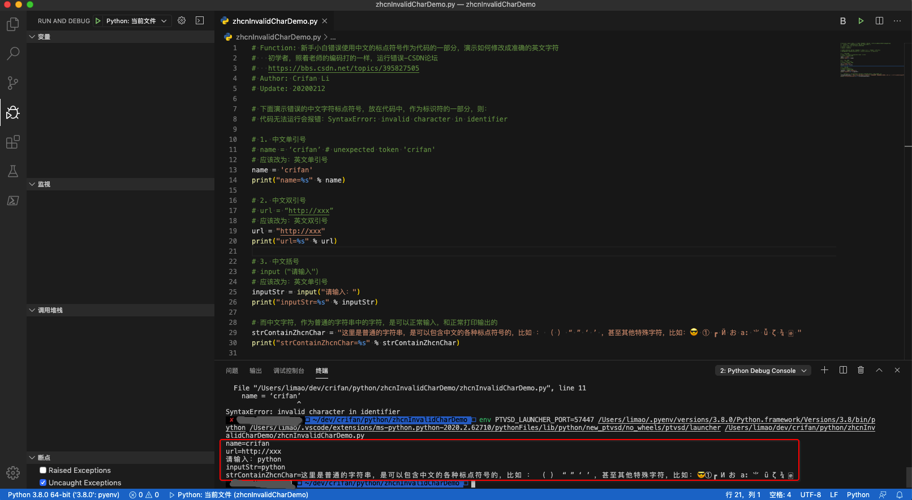
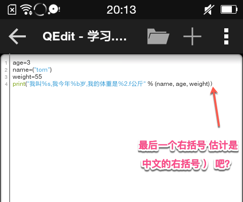
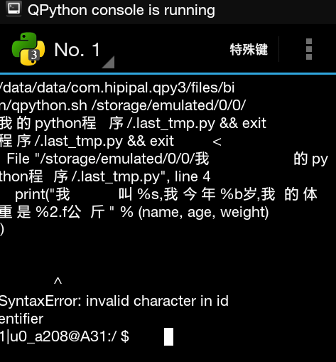
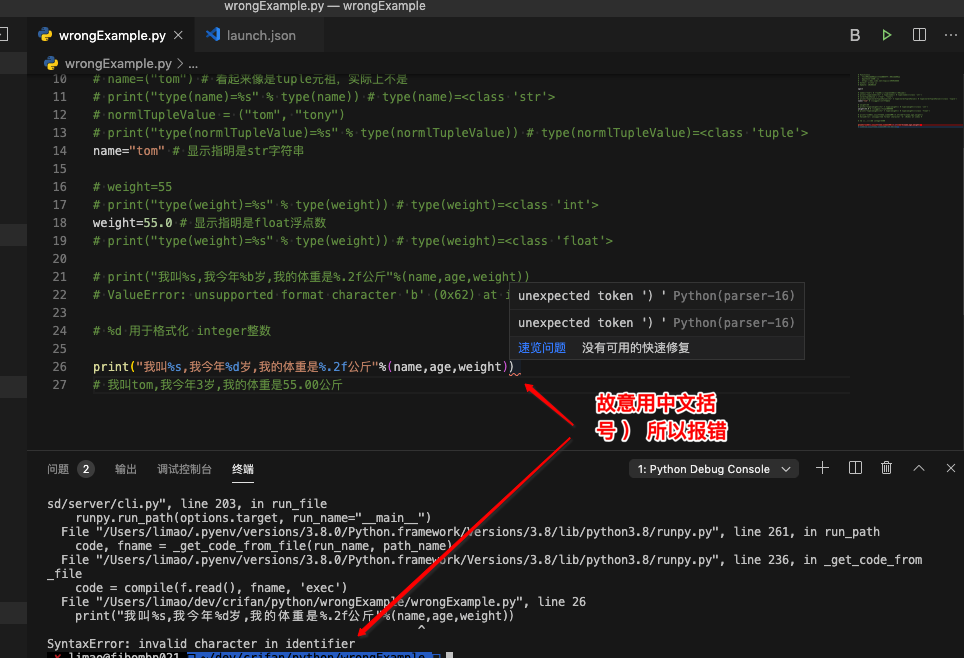

# 中文字符导致出错

很多初学者，不懂，或者不小心笔误，把中文的一些字符，比如：

* 逗号：`，`
* 引号
  * 单引号
    * 左单引号：`‘`
    * 右单引号：`’`
  * 双引号
    * 左双引号：`“`
    * 右双引号”：`”`
* 括号
  * 圆括号
    * 左圆括号：`（`
    * 右圆括号：`）`

不小心写到了代码里，变成了代码的一部分，导致语法上报错，导致代码无法运行。

截图举例：



对此问题，在此专门解释：

先说：标识符

编程语言，包括Python，中的各种，写在代码里，作为代码和表达式，中的各种符号，都必须是英文的。

否则你的编程语言的编译器，是无法识别，无法解析的，会报错的：

* 代码静态检测时报错：`unexpected token ‘xxx’`
* 代码运行会报错：`SyntaxError invalid character in identifier`

下面来举例说明：

常见的Python代码中（其实其他语言也是）非法的中文的标点符号 以及对应的英文标点符号是：

| 写在代码中，作为标点符号时：无效的中文字符 | 错误写法举例 | 应该改为：正确的英文字符 | 正确写法举例 |
| -----------------------------------| ---------- | -------------------- | ----------- |
| <ul>单引号：<li>左单引号：<code>‘</code></li><li>右单引号：<code>’</code></li></ul> | `name =‘crifan’` | 英文单引号（不分左右）：`'` | `name='crifan'` |
| <ul>双引号：<li>左双引号：<code>“</code></li><li>右双引号：<code>”</code></li></ul> | `url=“http://xxx”` | 英文双引号（不分左右）：`"` | `url="http://xxx"` |
| <ul>括号：<li>左括号：<code>（</code></li><li>右括号：<code>）</code></li></ul> | `input（"请输入"）` | <ul>英文括号：<li>左括号：<code>(</code></li><li>右括号：<code>)</code></li></ul> | `input("请输入")` |
| 逗号：<code>，</code> | `isOk，myScore = False，0` | 英文逗号：`,` | `isOk, myScore = False, 0` |

然后专门写了代码去演示效果：

```python
# Function: 新手小白错误使用中文的标点符号作为代码的一部分，演示如何修改成准确的英文字符
#   初学者，照着老师的编码打的一样，运行错误-CSDN论坛
#   https://bbs.csdn.net/topics/395827505
# Author: Crifan Li
# Update: 20200212
 
# 下面演示错误的中文字符标点符号，放在代码中，作为标识符的一部分，则：
# 代码无法运行会报错：SyntaxError: invalid character in identifier
 
# 1. 中文单引号
# name = ‘crifan’ # unexpected token 'crifan'
# 应该改为：英文单引号
name = 'crifan'
print("name=%s" % name)
 
# 2. 中文双引号
# url = “http://xxx”
# 应该改为：英文双引号
url = "http://xxx"
print("url=%s" % url)
 
# 3. 中文括号
# input（"请输入"）
# 应该改为：英文单引号
inputStr = input("请输入：")
print("inputStr=%s" % inputStr)
 
# 而中文字符，作为普通的字符串中的字符，是可以正常输入，和正常打印输出的
strContainZhcnChar = "这里是普通的字符串，是可以包含中文的各种标点符号的，比如 ： （ ） “ ” ‘ ’ ，甚至其他特殊字符，比如： ① ┏ Й お a: ⺌ ǚ ζ ¾ 🀅 "
print("strContainZhcnChar=%s" % strContainZhcnChar)
```

而如果把第一行解除注释，VSCode中就会提示代码错误：



把有问题的，中文字符作为标识符的，都注释掉，才能正常运行：



因此要记得，用于代码和变量和表达式中的字符，都一定要是英文字符，而不能是中文字符（或其他语言的特殊的字符）。

## 举例：中文右括号错误

### 问题

[Qpython3-CSDN论坛](https://bbs.csdn.net/topics/395926666)

### 解答

先说错误：

不过在具体解释之前，先针对其错误，给出自己的判断：



估计其输入代码时，最后一个括号是中文的括号，所以报错：



而之所以没说是`%b`引起的问题，是因为我自己调试了同样的代码后，知道如果是`%b`的话，会是另外不同错误提示：

```bash
ValueError: unsupported format character 'b' (0x62) at index 9
```

而不会是这里的：

```bash
SyntaxError: invalid character in identifier
```

解决办法：

把最后一个中文括号

weight)**）**

改为正常的英文括号

weight)**)**

后记：

后来也故意去把正确的代码，改为错误的，最后用了个中文的括号，所以也会报错的：



且没有运行之前，`pylint`就可以识别和检测出来，并提醒错误：

```bash
unexpected token ‘）’Python(parser-16)
```

以及：运行后也会报错：

```bash
File "/Users/limao/dev/crifan/python/wrongExample/wrongExample.py", line 26   print("我叫%s,我今年%d岁,我的体重是%.2f公斤"%(name,age,weight)                                                       ^
SyntaxError: invalid character in identifier
```

验证了我第一次的推断是对的：的确是中文括号的问题。
