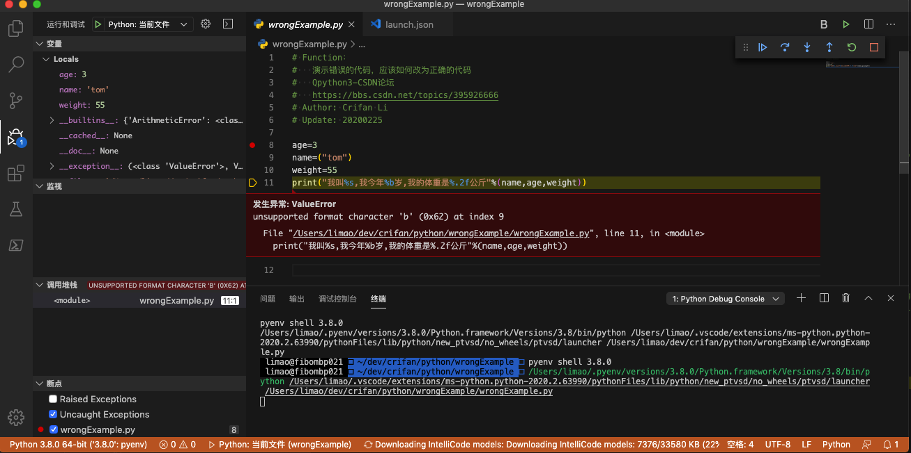
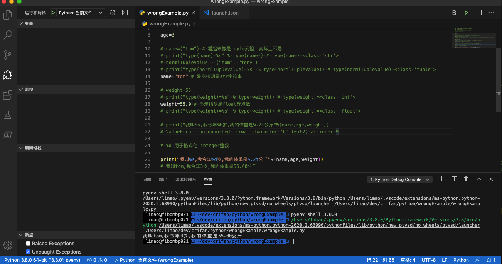

# 不要故意用错误语法

遇到一些新手，在写代码时，本身逻辑不是很清晰，又参考了别人一些错误的写法，导致代码无法输出预期结果。

下面举例来解释，什么叫故意写错，用了错误的语法，以及正确的语法是什么样的，应该怎么写。

## 举例：故意写错变量类型

看到

[Qpython3-CSDN论坛](https://bbs.csdn.net/topics/395926666)

代码中有很多错误的写法，且感觉是，被别人故意设计成这样的。

现在去详细解释如下：

对于代码：

```python
# Function：
#   演示错误的代码，应该如何改为正确的代码
#   Qpython3-CSDN论坛
#   https://bbs.csdn.net/topics/395926666
# Author: Crifan Li
# Update: 20200225

age=3
name=("tom")
weight=55
print("我叫%s,我今年%b岁,我的体重是%.2f公斤"%(name,age,weight))
```

去调试运行，肯定会报错：

```bash
unsupported format character 'b' (0x62) at index 9
```



所以，应该改为：

```python
# Function：
#   演示错误的代码，应该如何改为正确的代码
#   Qpython3-CSDN论坛
#   https://bbs.csdn.net/topics/395926666
# Author: Crifan Li
# Update: 20200225

age=3
# name=("tom")
# weight=55
# print("我叫%s,我今年%b岁,我的体重是%.2f公斤"%(name,age,weight))
# ValueError: unsupported format character 'b' (0x62) at index 9

name="tom" # 显示指明是str字符串，而不是 看起来像是tuple元祖，实际上不是
weight=55.0 # 显示指明是float浮点数
# %d 用于格式化 integer整数
print("我叫%s,我今年%d岁,我的体重是%.2f公斤"%(name,age,weight))
# 我叫tom,我今年3岁,我的体重是55.00公斤
```

其中：

### 不要假装是tuple，但实际却是str

```python
name=("tom")
```

是错误的示范和写法

因为`(xxx, yyy)`是标准的`tuple`**元祖**的语法

上述写法很容易让人产生误解，以为name是个tuple元祖变量

但实际上其却等价于：

```python
name="tom"
```

name实际上是个`str`**字符串**变量

所以，本来就应该改为正常的标准的写法：

```python
name="tom"
```

才对。

去加上`type`**变量类型**的打印，就容易对比看出区别了：

```python
name=("tom")
print("type(name)=%s" % type(name))
# type(name)=<class 'str’>
# normlTupleValue = ("tom", "tony")
print("type(normlTupleValue)=%s" % type(normlTupleValue)) 
# type(normlTupleValue)=<class 'tuple'>
```

### 不要故意用错误的格式化写法

`%d` 是用来格式化显示数字的

`%b`，是没见过的写法

即，此处的age是3岁，3个是integer整型数字，应该用%d去格式化输出，而不应该是%b

以及：weight=55

本意是：身体体重是55公斤

然后往往是个`float`浮点数，即有小数的部分的

所以后续是去用**浮点数**的`%.2f`去格式化显示的

但是此处初始化时的写法却是

```python
weight=55
```

此时，weight是`int`=`integer`=`整型`

而不是我们希望的：

`float`=`浮点数`

应该改为：

```python
weight=55.0
```

才对。

加上type变量类型的打印，就容易看出区别来了：

```python
weight=55
print("type(weight)=%s" % type(weight))
# type(weight)=class 'int'
weight=55.0 # 显示指明是float浮点数
print("type(weight)=%s" % type(weight))
# type(weight)=class 'float'
```

最终完整代码是：

```python
# Function：
#   演示错误的代码，应该如何改为正确的代码
#   Qpython3-CSDN论坛
#   https://bbs.csdn.net/topics/395926666
# Author: Crifan Li
# Update: 20200225

age=3
# name=("tom") # 看起来像是tuple元祖，实际上不是
# print("type(name)=%s" % type(name)) # type(name)=<class ‘str’>
# normlTupleValue = ("tom", "tony")
# print("type(normlTupleValue)=%s" % type(normlTupleValue)) # type(normlTupleValue)=<class ‘tuple’>
name="tom" # 显示指明是str字符串
# weight=55
# print("type(weight)=%s" % type(weight)) # type(weight)=<class ‘int’>
weight=55.0 # 显示指明是float浮点数
# print("type(weight)=%s" % type(weight)) # type(weight)=<class ‘float’>
# print("我叫%s,我今年%b岁,我的体重是%.2f公斤"%(name,age,weight))
# ValueError: unsupported format character ‘b’ (0x62) at index 9
# %d 用于格式化 integer整数
print("我叫%s,我今年%d岁,我的体重是%.2f公斤"%(name,age,weight))
# 我叫tom,我今年3岁,我的体重是55.00公斤
```

调试输出效果：



另外，关于`Python`中`print`参数的字符串格式化支持哪些，详见附录：

[print字符串格式化语法](https://book.crifan.com/books/python_newbie_mistakes_questions/website/appendix/print_str_format_syntax.html)
