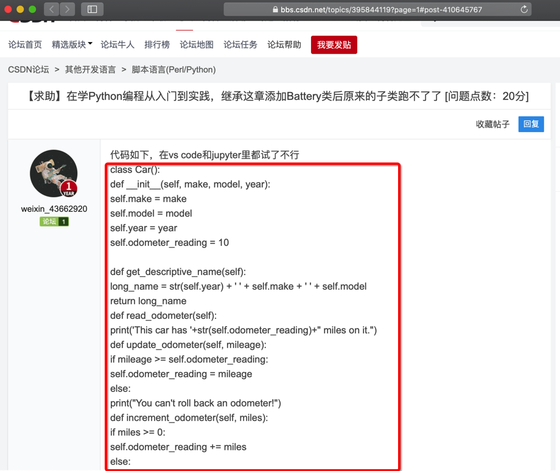
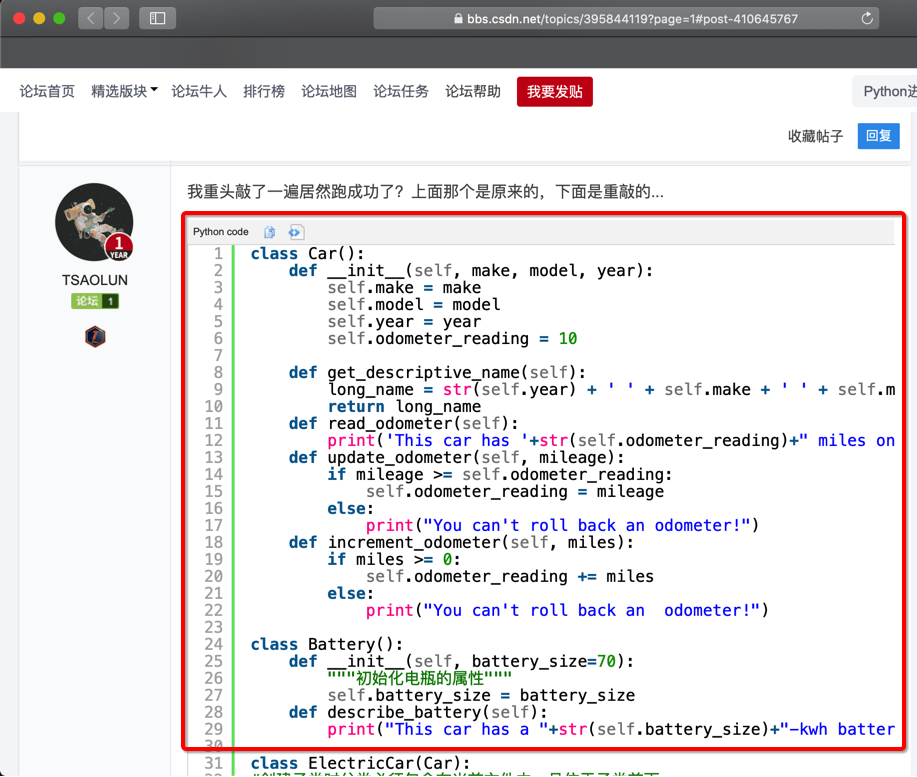

# 把问题要素描述清楚

如何学会提问？其实是个很大的话题

此处简略概述一下：

1. 文字描述出问题的背景和现象
  * 主要是，除了问题的具体现象外，还要说一下自己的当前的环境，包括但不限于：
     * 电脑类型：windows还是mac，还是Linux？
     * 所用语言和库的版本：Python 2还是3？具体是哪个版本？用的第三方库的版本是多少？
2. 对于代码的话，要贴出来出错的相关的代码，最好是完整的代码
3. 最好给出附带信息，尤其是截图

即提问之前，先要把自己的问题的要素描述清楚，完整的信息包括：

* 背景信息
  * 系统类型
    * Win
    * Mac
    * Linux
      * 具体哪个发行版？
        * Ubuntu
        * CentOS
        * 其他？
  * 什么开发语言
    * Python
    * Java
    * 其他？
  * 某个开发语言的某个库？
    * 举例：
      * Python的网络库Requests
  * 具体的版本
    * 举例
      * CentOS
        * CentOS 6.4
        * CentOS 7
      * Python
        * Python 2.7
        * Python 3.8
* 具体信息
  * 错误：
    * 最基本要有：文字描述
      * 且要描述清楚，不要模糊不清
    * 最好也有：
      * 截图
      * 相关代码
        * 且带语法高亮的代码：更易读

## 关于贴出格式化后高亮的代码

比如，作为对于问题提问者贴出来的代码：

和：

* 问：你作为想要回答问题的人，你会喜欢哪个？
* 答：很明显是第二个
  * 因为代码加了语法高亮
    * 更容易看清楚代码的格式和逻辑
      * 否则还要回答的人去花精力去看懂和研究你的代码
        * 别人回答你的问题的意愿就降低了
          * 即：浪费别人的时间就是浪费你自己的时间

另外，对于代码缩进：

尤其是对于Python语言来说，Python代码中的缩进，不仅是美观问题，还影响代码层次和逻辑。缩进错了，代码逻辑可能也错了。

所以结论就是：

* 帮助别人就是帮助自己
  * 提问时给出问题的详细信息
    * 包括
      * 截图
      * 格式化好（高亮）的代码
      * 等
  * 就是给别人省时间
    * 也就是给自己省时间
