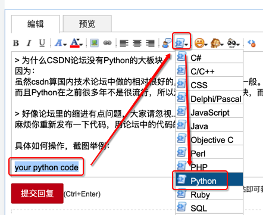
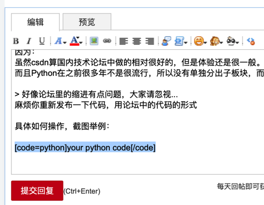
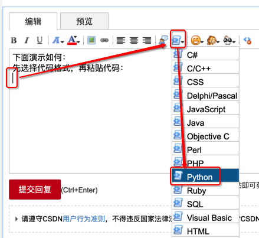
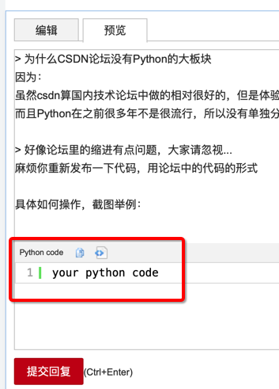
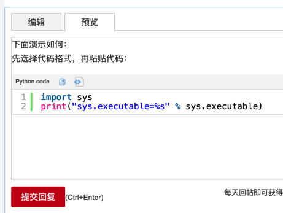

# csdn的bbs论坛

csdn的bbs论坛中提问题时如何贴代码

而关于贴代码到论坛中的问题，很多小白不会用论坛中的编辑器，不会贴代码。

下面把：

[【求助】在学Python编程从入门到实践，继承这章添加Battery类后原来的子类跑不了了-CSDN论坛](https://bbs.csdn.net/topics/395844119?page=1#post-410645767)

回复别人的内容整理如下，作为解释：csdn的bbs论坛中提问题时如何贴代码 的回答：

csdn中粘贴代码的核心逻辑是：

确保输入的内容是符合下面这种格式：

```markdown
[code=python]此处粘贴你的代码即可[/code]
```

即可，此时

* 发布后的回复中
* 发布出来的问题帖子中
* 发布之前，点击预览

就是带彩色的，代码高亮后的，效果好看的代码了

对于如何让代码变成上面这种格式，有多种操作方式：

### 方式1：自己手动输入

其实就是普通的文字，文本，自己输入：

```markdown
[code=python][/code]
```

然后把你要代码放进去，即可。

### 通过编辑器自动插入

又分2种：

* 方式1：选中代码 -> 选择格式 -> 选择某个语言（比如Python）
  * 
  * 
* 方式2：鼠标点击要插入代码的位置 -> 选择格式 -> 选择某个语言（比如Python）->再粘贴代码进去
  * 鼠标定位到要粘贴代码的位置，然后去选择：代码->Python
    * 
  * 会自动输入：
    * `[code=python][/code]`
  * 再粘贴代码到里面：
    * 比如：
      ```markdown
      [code=python]
      import sys
      print("sys.executable=%s" % sys.executable)
      [/code]
      ```

至此，就能看到代码高亮的效果了：

* 发布前的预览
  * 
* 真正发布后
  * 

这样就可以保留原始代码的格式

而带缩进的代码也就不会乱了。

且显示起来带颜色，即代码高亮，更易读。

别人（想要帮你，回答你问题的人）也容易**拷贝出完整代码**，帮你测试代码，找到问题原因。
