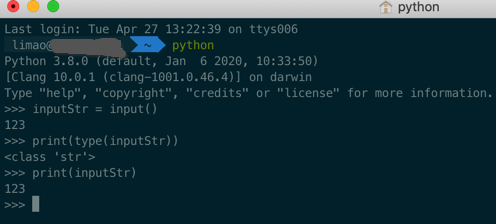
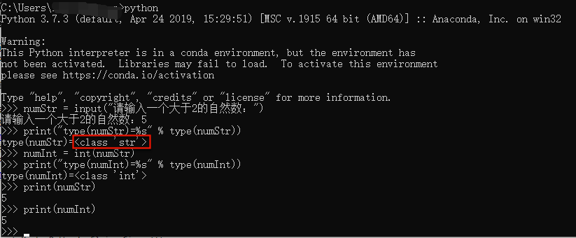
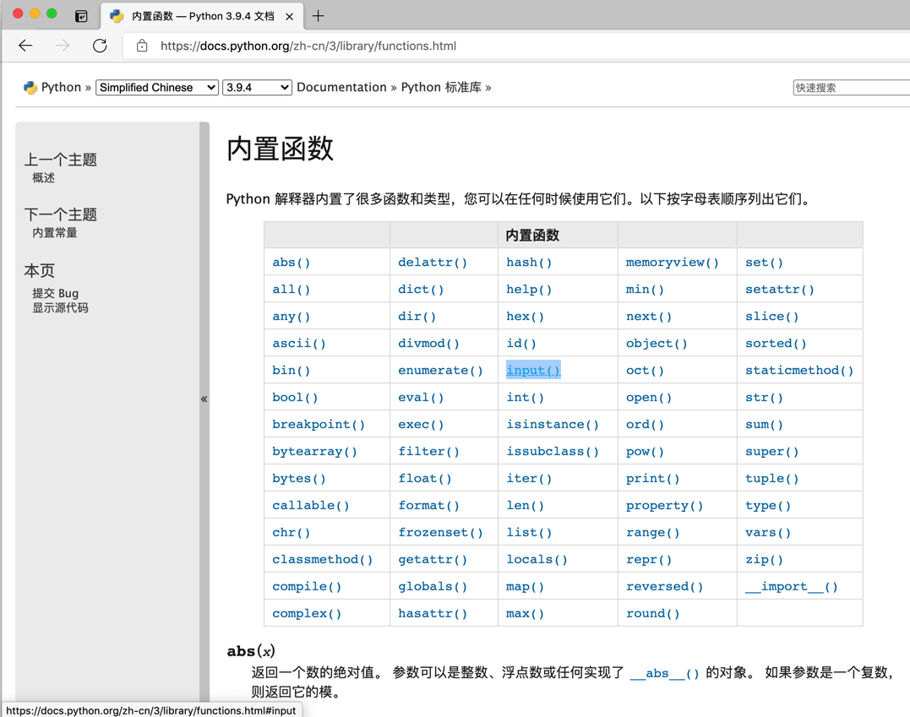
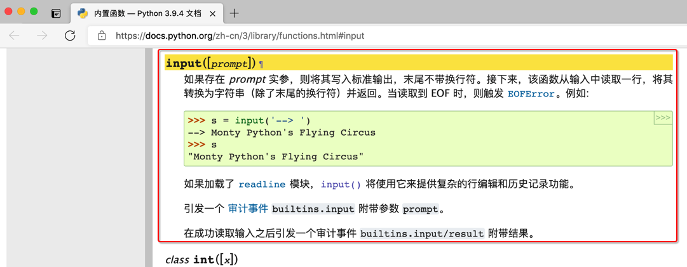

# input返回值是字符串

新手常犯的一个问题是：以为input返回的值是`int`数字等所希望的类型

但其实：input返回的值，都是`str`**字符串**类型。

## 演示代码

此处，用如下简单的代码，演示，input返回值是字符串`str`

```python
limao@xxx  ~  python
Python 3.8.0 (default, Jan  6 2020, 10:33:50)
[Clang 10.0.1 (clang-1001.0.46.4)] on darwin
Type "help", "copyright", "credits" or "license" for more information.
>>> inputStr = input()
123
>>> print(type(inputStr))
<class 'str'>
>>> print(inputStr)
123
>>>
```



其中可见：

* 输入了`123`，通过`input`返回后的变量类型
  * 是：`str`字符串 -> 内部表示是 **'123'**
    * 不是，（python小白）以为的：`int`整数 -> 内部表示是：**123**

## 常见input相关问题

### 把input返回值当做int数值

把`input`返回的内容是**字符串**而不是以为的变量类型，比如`int`=整数，`float`=浮点数等

[看看哪里错了，快崩溃了-CSDN论坛](https://bbs.csdn.net/topics/397990611)

类似的：[Python求助-CSDN论坛](https://bbs.csdn.net/topics/399170543)

**问题**

利用列表实现筛选法求素数

问题描述：编写程序，输入一个大于2的自然数，然后输出小于该数字的所有素数组成的列表

```python
def sushu(num):
    lst=[]
    for i in range(2,num):
        flag = 1
        for j in range(2,i):
            if i%j==0:
                flag=0
                break
            
        if flag:
            lst.append(i)
    print(lst)

num=input("请输入一个大于2的自然数：")
sushu(num)
```

**解答**

你是把

```python
num=input("请输入一个大于2的自然数：")
```

得到的`num`以为是 `数字`=`int` 类型了

其实是`字符串`=`str`类型

所以可以通过打印变量类型，更好的理解代码逻辑：

```python
numStr = input("请输入一个大于2的自然数：")
print("type(numStr)=%s" % type(numStr))
# <class 'str'>
numInt = int(numStr)
print("type(numInt)=%s" % type(numInt))
# <class 'int'>
```



注意到，input返回的变量类型，通过`type(numStr)`查看到，是`<class 'str'>`，即是str字符串的类型

## Python官网中input的解释

此处再去深究，Python中官网中，关于input，是如何解释的：

* Python中的内置函数
  * 中文
    * https://docs.python.org/zh-cn/3/library/functions.html
      * 
  * 英文
    * https://docs.python.org/3/library/functions.html
* -> 内置函数：`input`
  * 中文
    * https://docs.python.org/zh-cn/3/library/functions.html#input
        ```python
        input([prompt])
        如果存在 prompt 实参，则将其写入标准输出，末尾不带换行符。接下来，该函数从输入中读取一行，将其转换为字符串（除了末尾的换行符）并返回。当读取到 EOF 时，则触发 EOFError。例如:

        >>>
        >>> s = input('--> ')  
        --> Monty Python's Flying Circus
        >>> s  
        "Monty Python's Flying Circus"
        如果加载了 readline 模块，input() 将使用它来提供复杂的行编辑和历史记录功能。

        引发一个 审计事件 builtins.input 附带参数 prompt。

        在成功读取输入之后引发一个审计事件 builtins.input/result 附带结果。
        ```
        
  * 英文
    * https://docs.python.org/3/library/functions.html#input
        ```python
        input([prompt])¶
        If the prompt argument is present, it is written to standard output without a trailing newline. The function then reads a line from input, converts it to a string (stripping a trailing newline), and returns that. When EOF is read, EOFError is raised. Example:

        >>>
        >>> s = input('--> ')  
        --> Monty Python's Flying Circus
        >>> s  
        "Monty Python's Flying Circus"
        If the readline module was loaded, then input() will use it to provide elaborate line editing and history features.

        Raises an auditing event builtins.input with argument prompt before reading input

        Raises an auditing event builtins.input/result with the result after successfully reading input.
        ```

其中官网中`input`的内部处理过程，都已经解释的很明确了：

**该函数从输入中读取一行，将其转换为<font color=red>字符串</font>（除了末尾的换行符）并返回**

即，`input`返回的值是<font color=red>字符串</font>类型`str`，不是很多人以为的`int`、`float`等数值类型

