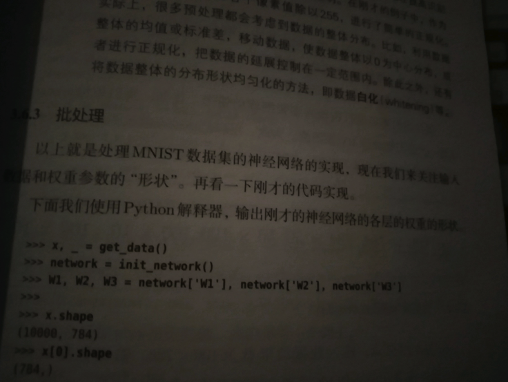
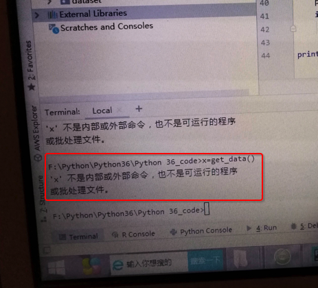
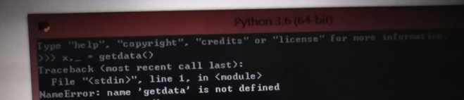

# Python的shell不是系统终端

此处通过例子来说明，使得新手和小白明白，`系统的终端shell`和`Python shell`不是一个东西。

这个概念需要搞清楚，然后才能正常开发。

## 举例

### 关于python解释器的问题

#### 问题

[关于python解释器的问题?-CSDN论坛](https://bbs.csdn.net/topics/397145604)

> 这个教材说用python解释器执行如下代码，我使用的是pycharm，然后用了terminal告诉我没有这个命令
> 
> 然后，我用cmd也不行
> 
> 然后用python3.6的那个终端，还不行
> 
> 之前，也遇到过这种状况，就是terminal必须弄一个虚拟环境才能运行整个库
> 
> 我很无奈，就是想问问如何使用终端生成这个东西!




#### 解答

* **简答**：
  * 你
    * 先要搞清楚，书中代码是python shell中运行的
    * 其次还要搞清楚，那段get_date()代码，是需要先输入函数定义，才能继续调用执行的
  * 都搞清楚后
    * 就可以在python shell中输入完整代码，去测试你要的效果了
* **详解**：

对于图片：


很明显是从书中拍的照片

而其中的：

```python
>>> x, _ = get_data()
>>> network = init_network()
...
```

等内容，是：在`Python的shell`中去测试的代码

对此先要去搞清楚：[什么是Python的shell]()

你此处：

截图的书中的代码：

```python
x, _ get_data()
network = init_network()
...
```

明显是，用来放到`Python shell`中才（可）能运行。

所以你说的：

> 这个教材说用python解释器执行如下代码，我使用的是pycharm，然后用了terminal告诉我没有这个命令

好像对应是这个截图：



```bash
x=get_data()
‘x’ 不是内部或外部命令，也不是可运行的程序或批处理文件
```

回答你这句之前，先要给你解释清楚，即你先要明白，要搞清楚：

以及再需要去搞清楚：[什么是系统的终端]()

以及：[引申：编辑器和IDE的终端往往就是系统的终端]()

> 然后，我用cmd也不行

至此你也（应该）明白了，理解了，此 PyCharm的终端=系统的终端 不等于  Python的shell终端

也就没法直接运行你的Python代码了。

然后再去搞懂对比：[Python的shell对比系统的终端]()

> 然后用python3.6的那个终端，还不行

你说的应该是：



很明显，此处：

* 你不仅（粗心，笔误）把get_data()误写成getdata()
* 还不理解：Python中代码执行的基本逻辑
    * get_data()是个函数的调用
        * 需要你先把函数实现=函数定义 写出来，或者是导入别的实现了此函数的库
            * 然后才能去调用此函数，运行此函数

在具体点说就像是，你能运行：

```python
x, _ = get_data()
```

的前提是，前面已有类似get_data()的具体实现，类似于：

```python
def get_data()
    ...
    return x, y
```

然后你才能调用：

```python
x, _ = get_data()
```

否则，当然，也就会报错：

```bash
NameError: name ‘getdata’ is not defined
```

中文翻译为：

**名字错误：getdata这个（变量或函数的）名字没有定义**

> 之前，也遇到过这种状况，就是terminal必须弄一个虚拟环境才能运行整个库

其实你说的，大意是对的，但是细节上的逻辑还是不严谨的

其实不是 “弄一个虚拟环境” 才能运行整个库

至少对于前面这几行要测试的代码，则只是：

先要确保你的get_data()函数有定义了，你已经在Python的shell中输入了get_data()的定义了，或者导入了相关的库，然后

```python
x, _ = get_data()
```

这行代码才能正常运行

类似的后续代码，也都要：对应函数有定义，才能正常运行。

> 我很无奈，就是想问问如何使用终端生成这个东西!

就是按照我前面所说的：

找到get_data()等函数的定义，输入到终端中

（且确保当前Python环境是OK的，即相关依赖的库已安装等）

然后就可以在终端中（输入代码，运行代码）生成（你要的）这个东西了。

不过话说关于Python入门开发的IDE的选择，我多年前就不推荐用IDLE：

小白用户，**不要用python的shell或IDLE**，而是去**用编辑器或IDE去开发Python**

详见：

* [4.1.4.1. 对初学者的建议：如何选用Python的开发环境](https://www.crifan.com/files/doc/docbook/python_beginner_tutorial/release/html/python_beginner_tutorial.html#recommand_for_beginner_on_how_choose_python_dev_env)
  * 注
    1. 可以把
       * > Windows的cmd + Notepad++
       * 改为：**Windows的cmd + VSCode**
    2. 其中关于VSCode开发Python，可以参考最新的：
       * [调试Python · 史上最好用的编辑器：VSCode](https://book.crifan.com/books/best_editor_vscode/website/debug_code/debug_python/)

以及不了解开发方式的小白，可参考我之前写的：

[python初级教程：入门详解](https://www.crifan.com/files/doc/docbook/python_beginner_tutorial/release/html/python_beginner_tutorial.html)

中的：

* [4.1.1. Python的最原始的开发方式是什么样的](https://www.crifan.com/files/doc/docbook/python_beginner_tutorial/release/html/python_beginner_tutorial.html#primitive_env_dev_python)
* [4.1.2. 利用Python的shell进行交互式开发又是什么样的](https://www.crifan.com/files/doc/docbook/python_beginner_tutorial/release/html/python_beginner_tutorial.html#use_python_interactive_shell_do_dev)
* [4.1.3. 利用第三方Python的IDE进行Python开发又是怎么回事](https://www.crifan.com/files/doc/docbook/python_beginner_tutorial/release/html/python_beginner_tutorial.html#use_thirdparty_python_ide_do_dev)

看完后，相信你会对Python开发的编辑器，IDE等概念有个更加充分的认识。

之后就不会出现此提问者这种对于概念混淆的问题了。
