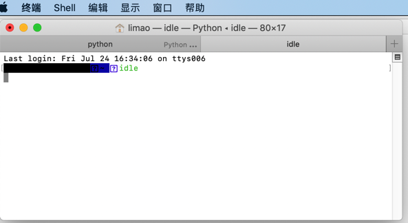
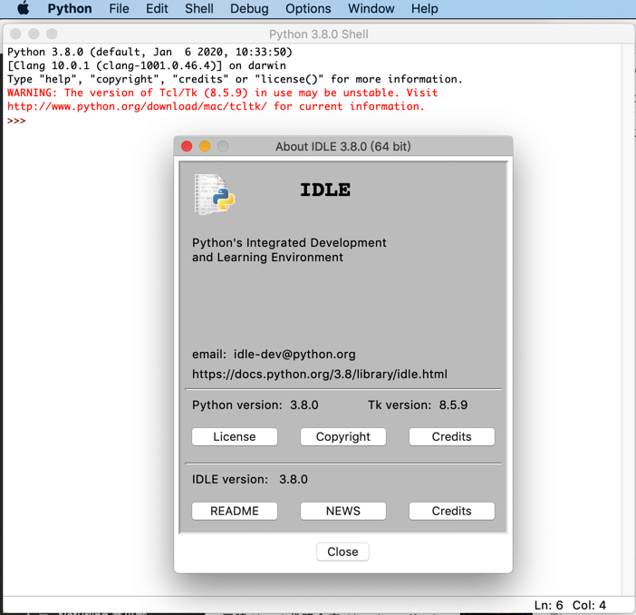
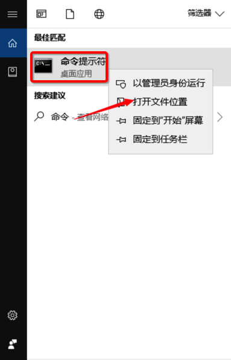
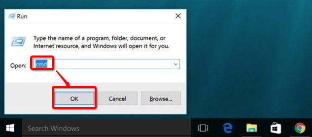
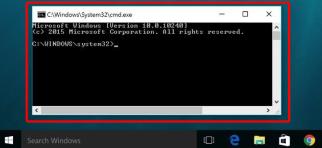
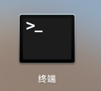
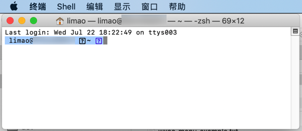

# Python的shell和系统的终端

然后总结关于 `系统终端` 和 `Python shell`的内容。

希望看完后，小白新手能搞清楚：

* **Python shell 不是 系统终端**

以及相关的概念和逻辑：

* 什么是 系统的终端中运行Python shell
* 不能在系统中的终端中运行Python代码
  * 应该在Python shell中运行Python代码
* 不能在Python shell中运行系统命令
  * 应该在系统终端中运行系统命令

## 什么是Python的shell

* Python的shell
    * 是什么：交互式的，一个命令行的界面
    * 干什么：
        * 供你输入代码，测试代码用的
            * 你所输入的代码，往往是很少的代码片段
                * 比如：一行或几行的Python代码
                * -》很少有一次性输入很多很多行的Python代码
                    * 对于多行的、非常多的、大型的的Python代码，则往往保存到独立的（后缀是.py的）Python文件中，再去用专业的开发工具去测试和运行
                        * 比如PyCharm或VSCode等Python的编辑器或IDE
                * 所以：往往第三方其他的库，才用Python的shell去演示基本的用法
                    * 比如：你这里的人工智能方面的Python测试代码，
    * 特点
        * 安装了Python提供的，即安装了Python就自带的
    * 如何启动和长什么样
        * 先说版本：
            * 不带图形界面的，纯文字的，命令行的效果，叫：`python shell`
            * 基于图形界面的，叫做：`IDLE`
        * 再说如何启动：
            * `Python shell`
                * 直接在终端中运行python，即可进入`Python shell`
                    * Mac
                        * 
            * `IDLE`
                * Mac
                    * 通过点击或运行IDLE才能启动
                        * 
                        * ->
                        * 
                        * 

## 什么是系统的终端

* 系统的终端：
    * 针对不同系统
        * Windows中，默认的是cmd=命令行=命令提示符
            * 长这样
                * 
                * 英文版
                    * 
            * 对应cmd.exe这个文件：
                * 
                * 文件属性：
                    * 
            * 如何启动=运行：
                * 2种方式
                    * 点击上述 命令提示符
                    * `Wind+R` -> 输入`cmd` -> 回车
                        * 
            * 启动=运行后长这样
                * 
        * Mac中的Terminal
            * 长这样
                * 
            * 启动=运行后长这样
                * 
        * Linux中的shell
            * 各种发行版
              * Ubuntu
                * 启动后，长这样：
                  * 

### 引申：编辑器和IDE的终端往往就是系统的终端

对应的，很多编辑器和IDE，比如`VSCode`、`PyCharm`等，其中的`终端`往往是用的就是系统的终端。

举例：

* VSCode中的终端
* PyCharm中的终端
  * PyCharm中的Terminal（往往）是系统的终端
    * 往往就是系统自带的终端，即win的cmd或Mac的Terminal等

### 引申：在系统终端中启动Python shell

所以一种常见的启动Python shell的方式就是，在系统终端中输入`python`，就可以方便的启动python shell：

然后继续在`python shell`中写（一般是小段的）代码，去测试代码逻辑是否运行正常。

## Python的shell对比系统的终端

关于：

* Python的shell
* 系统的终端

先贴出截图对比说明：

再详细解释：

* `Python的shell`，是Python给你提供了一个**环境**，可以用来执行，运行（你所输入的）Python代码的环境
  * 即：其底层已经有个Python的**解释器**在运行
    * 因此才能实现，你输入了Python代码，回车后，就可以运行代码，看到运行后的结果了
  * 长什么样：每一行的开头往往是 三个大于号`>>>`
* （`Win`/`Mac`/`Linux`等）系统的终端，只支持系统的命令，而无法直接支持，直接能运行你所输入的Python代码
  * 长什么样：每一行的开头，往往是 单个字符或符号：井号`#` / 大于号`>`
  * 所以如果输入系统不存的命令：
    * 举例
      * `x=get_data()`
      * 就会报错：
      * `'x' 不是内部或外部命令，也不是可运行的程序或批处理文件`
        * 而这种错误，其实对于初学者也很常见
          * 就是因为连基本的系统终端和系统支持的命令等基础概念都不清楚，所以常会犯此初级错误
  * 那哪些才是系统支持的命令呢？
    * 比如
      * `Win`中的
        * `dir`：列出当前目录中的内容
        * `cd xxx`：切换到xxx目录
        * 等等
      * `Mac`/`Linux`等 中的
        * `ls`：列出当前目录中的内容
        * `pwd`：显示当前目录所在路径
        * 等等
