# 系统终端和Python shell

此处通过例子来说明，`系统的终端shell`和`Python shell`之间的区别和相关基础知识。

## 例子：关于python解释器的问题

### 问题

[关于python解释器的问题?-CSDN论坛](https://bbs.csdn.net/topics/397145604)

> 这个教材说用python解释器执行如下代码，我使用的是pycharm，然后用了terminal告诉我没有这个命令
> 
> 然后，我用cmd也不行
> 
> 然后用python3.6的那个终端，还不行
> 
> 之前，也遇到过这种状况，就是terminal必须弄一个虚拟环境才能运行整个库
> 
> 我很无奈，就是想问问如何使用终端生成这个东西!

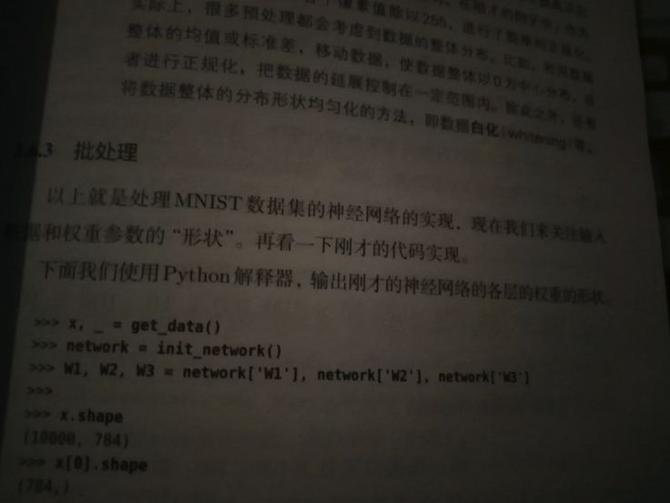

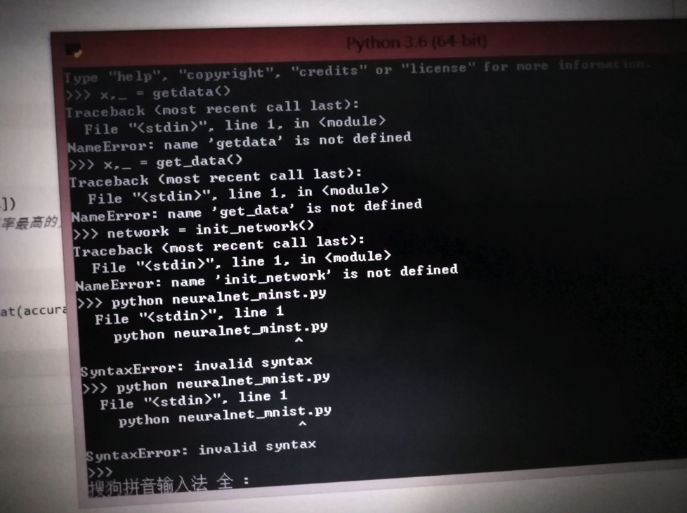

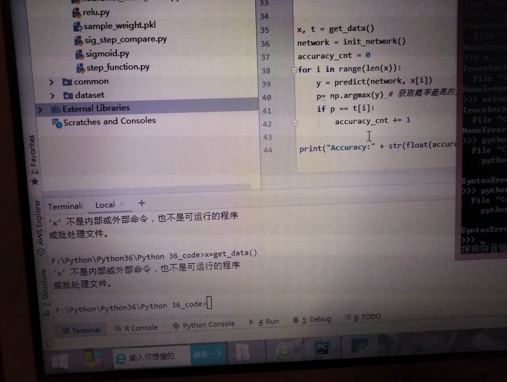

### 解答

* **简答**：
  * 你
    * 先要搞清楚，书中代码是python shell中运行的
    * 其次还要搞清楚，那段get_date()代码，是需要先输入函数定义，才能继续调用执行的
  * 都搞清楚后
    * 就可以在python shell中输入完整代码，去测试你要的效果了
* **详解**：

对于图片：

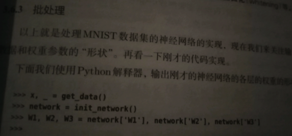

很明显是从书中拍的照片

而其中的：

```python
>>> x, _ = get_data()
>>> network = init_network()
...
```

等内容，是：在`Python的shell`中去测试的代码

对此先要去搞清楚：

问：**什么是Python的shell？**

答：
* Python的shell
    * 是什么：交互式的，一个命令行的界面
    * 干什么：
        * 供你输入代码，测试代码用的
            * 你所输入的代码，往往是很少的代码片段
                * 比如：一行或几行的Python代码
                * -》很少有一次性输入很多很多行的Python代码
                    * 对于多行的、非常多的、大型的的Python代码，则往往保存到独立的（后缀是.py的）Python文件中，再去用专业的开发工具去测试和运行
                        * 比如PyCharm或VSCode等Python的编辑器或IDE
                * 所以：往往第三方其他的库，才用Python的shell去演示基本的用法
                    * 比如：你这里的人工智能方面的Python测试代码，
    * 特点
        * 安装了Python提供的，即安装了Python就自带的
    * 如何启动和长什么样
        * 先说版本：
            * 不带图形界面的，纯文字的，命令行的效果，叫：`python shell`
            * 基于图形界面的，叫做：`IDLE`
        * 再说如何启动：
            * `Python shell`
                * 直接在终端中运行python，即可进入`Python shell`
                    * Mac
                        * 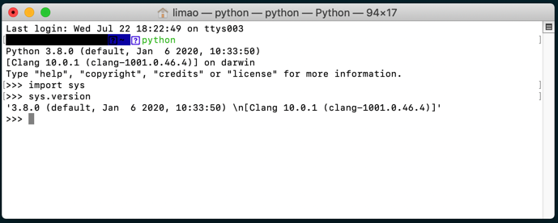
            * `IDLE`
                * Mac
                    * 通过点击或运行IDLE才能启动
                        * 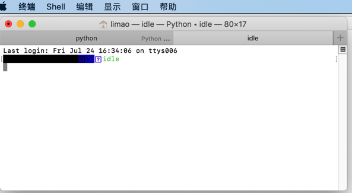
                        * ->
                        * 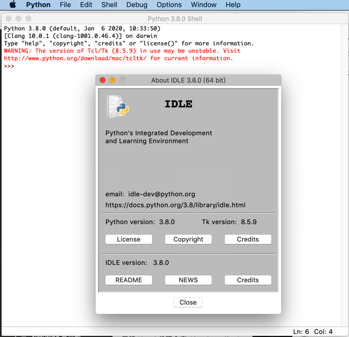
                        * 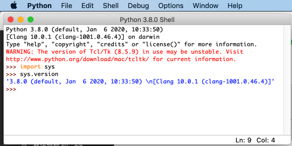

你此处：

截图的书中的代码：

```python
x, _ get_data()
network = init_network()
...
```

明显是，用来放到`Python shell`中才（可）能运行。

所以你说的：

> 这个教材说用python解释器执行如下代码，我使用的是pycharm，然后用了terminal告诉我没有这个命令

好像对应是这个截图：

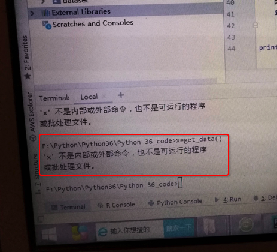

```bash
x=get_data()
‘x’ 不是内部或外部命令，也不是可运行的程序或批处理文件
```

回答你这句之前，先要给你解释清楚，即你先要明白，要搞清楚：

**PyCharm中的Terminal是什么？**

PyCharm中的Terminal（往往）是系统的终端

比如你所在Windows或Mac或Linux的终端

而：

**什么是系统的终端呢？**

* 系统的终端：
    * 针对不同系统
        * Windows中，默认的是cmd=命令行=命令提示符
            * 长这样
                * 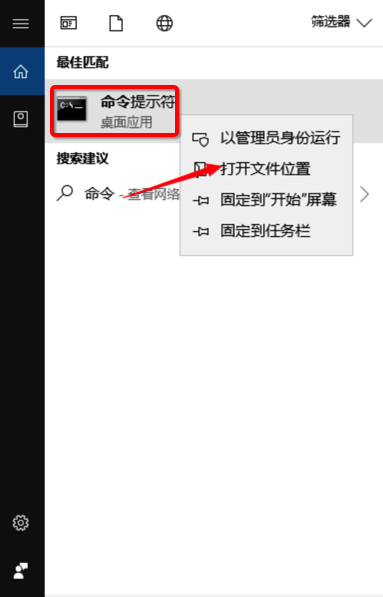
                * 英文版
                    * 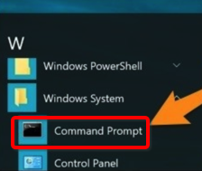
            * 对应cmd.exe这个文件：
                * 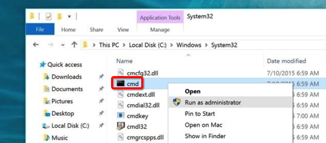
                * 文件属性：
                    * 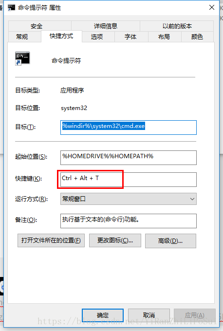
            * 如何启动=运行：
                * 2种方式
                    * 点击上述 命令提示符
                    * `Wind+R` -> 输入`cmd` -> 回车
                        * 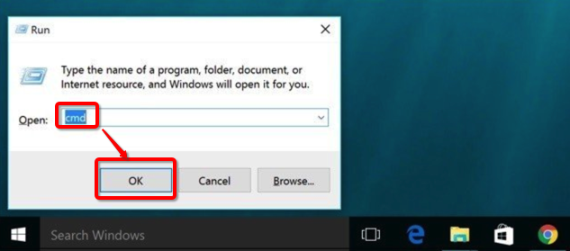
            * 启动=运行后长这样
                * 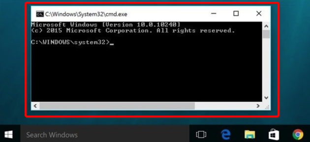
        * Mac中的Terminal
            * 长这样
                * 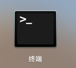
            * 启动=运行后长这样
                * 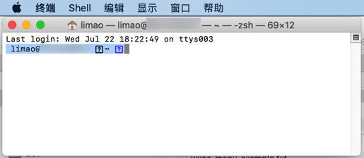
        * Linux中的shell
            * TODO：加上logo和启动后效果截图

而你PyCharm中的Terminal，往往就是系统自带的终端，即win的cmd或Mac的Terminal等。

> 然后，我用cmd也不行

至此你也（应该）明白了，理解了，此 PyCharm的终端=系统的终端 不等于  Python的shell终端

也就没法直接运行你的Python代码了。

即：

* `Python的shell`，是Python给你提供了一个**环境**，可以用来执行，运行（你所输入的）Python代码的环境
    * 即：其底层已经有个Python的**解释器**在运行
        * 因此才能实现，你输入了Python代码，回车后，就可以运行代码，看到运行后的结果了
* 与之对比：（`Win`/`Mac`/`Linux`等）系统的终端，只支持系统的命令，而无法直接支持，直接能运行你所输入的Python代码
    * 所以如果输入系统不存的命令：
        * `x=get_data()`
    * 也才会报错：
        * ‘x’ 不是内部或外部命令，也不是可运行的程序或批处理文件
            * 而这种错误，其实对于初学者也很常见
                * 就是因为连基本的概念都不清楚，所以常会犯此低级的错误
    * 那哪些才是系统支持的命令呢？
        * 比如
            * `Win`中的
                * `dir`：列出当前目录中的内容
                * `cd xxx`：切换到xxx目录
                * 等等
            * `Mac`/`Linux`等 中的
                * `ls`：列出当前目录中的内容
                * `pwd`：显示当前目录所在路径
                * 等等

> 然后用python3.6的那个终端，还不行

你说的应该是：

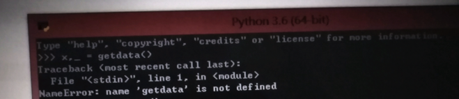

很明显，此处：

* 你不仅（粗心，笔误）把get_data()误写成getdata()
* 还不理解：Python中代码执行的基本逻辑
    * get_data()是个函数的调用
        * 需要你先把函数实现=函数定义 写出来，或者是导入别的实现了此函数的库
            * 然后才能去调用此函数，运行此函数

在具体点说就像是，你能运行：

```python
x, _ = get_data()
```

的前提是，前面已有类似get_data()的具体实现，类似于：

```python
def get_data()
    ...
    return x, y
```

然后你才能调用：

```python
x, _ = get_data()
```

否则，当然，也就会报错：

```bash
NameError: name ‘getdata’ is not defined
```

中文翻译为：

**名字错误：getdata这个（变量或函数的）名字没有定义**

> 之前，也遇到过这种状况，就是terminal必须弄一个虚拟环境才能运行整个库

其实你说的，大意是对的，但是细节上的逻辑还是不严谨的

其实不是 “弄一个虚拟环境” 才能运行整个库

至少对于前面这几行要测试的代码，则只是：

先要确保你的get_data()函数有定义了，你已经在Python的shell中输入了get_data()的定义了，或者导入了相关的库，然后

```python
x, _ = get_data()
```

这行代码才能正常运行

类似的后续代码，也都要：对应函数有定义，才能正常运行。

> 我很无奈，就是想问问如何使用终端生成这个东西!

就是按照我前面所说的：

找到get_data()等函数的定义，输入到终端中

（且确保当前Python环境是OK的，即相关依赖的库已安装等）

然后就可以在终端中（输入代码，运行代码）生成（你要的）这个东西了。

不过话说关于Python入门开发的IDE的选择，我多年前就不推荐用IDLE：

小白用户，**不要用python的shell或IDLE**，而是去**用编辑器或IDE去开发Python**

详见：

* [4.1.4.1. 对初学者的建议：如何选用Python的开发环境](https://www.crifan.com/files/doc/docbook/python_beginner_tutorial/release/html/python_beginner_tutorial.html#recommand_for_beginner_on_how_choose_python_dev_env)
  * 注
    1. 可以把
       * > Windows的cmd + Notepad++
       * 改为：**Windows的cmd + VSCode**
    2. 其中关于VSCode开发Python，可以参考最新的：
       * [调试Python · 史上最好用的编辑器：VSCode](https://book.crifan.com/books/best_editor_vscode/website/debug_code/debug_python/)

以及不了解开发方式的小白，可参考我之前写的：

https://www.crifan.com/files/doc/docbook/python_beginner_tutorial/release/html/python_beginner_tutorial.html

中的：
* [4.1.1. Python的最原始的开发方式是什么样的](https://www.crifan.com/files/doc/docbook/python_beginner_tutorial/release/html/python_beginner_tutorial.html#primitive_env_dev_python)
* [4.1.2. 利用Python的shell进行交互式开发又是什么样的](https://www.crifan.com/files/doc/docbook/python_beginner_tutorial/release/html/python_beginner_tutorial.html#use_python_interactive_shell_do_dev)
* [4.1.3. 利用第三方Python的IDE进行Python开发又是怎么回事](https://www.crifan.com/files/doc/docbook/python_beginner_tutorial/release/html/python_beginner_tutorial.html#use_thirdparty_python_ide_do_dev)

看完后，相信你会对Python开发的编辑器，IDE等概念有个更加充分的认识。

之后就不会出现此提问者这种对于概念混淆的问题了。
